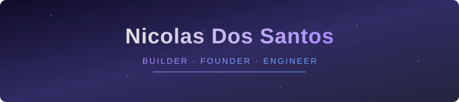
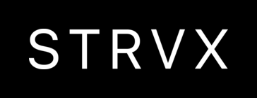
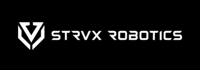

 

 

 

I build companies and the software behind them. My main focus is **STRVX Robotics**: offline multi-drone autonomy and tactical overwatch for GPS-denied environments, VC-backed and currently in Founders Inc Off Season II. I also run **STRVX**, an AI consultancy that ships internal AI tools, document pipelines, and automated reporting for real businesses. On the side I build native iOS apps, real-time intelligence dashboards, and autonomous AI agents that run 24/7 on bare metal. Math-CS @ UC San Diego. SWE @ UCSD ITS. Cyber Defense Ops @ CA Air National Guard.

## What I've Shipped

| Project | What It Does | Stack | Status |
|---------|-------------|-------|--------|
| **[STRVX Robotics](https://strvxrobotics.com)** | Offline multi-drone autonomy and tactical overwatch. One operator commands 1 to 6 ISR drones in GPS-denied environments. | Next.js · TypeScript · Supabase · Vercel | **VC-backed · Founders Inc Off Season II** |
| **[STRVX](https://strvx.com)** | AI consultancy shipping internal AI tools, document pipelines, data extraction, and automated reporting. Fixed scope, fixed price. | Next.js · TypeScript · Supabase · Claude API | Live · founder |
| **CTRL** | Screen time and parental controls for iOS | SwiftUI · Firebase · ScreenTime API · RevenueCat | In production |
| **[Claude Control Panel](https://github.com/NewCoder3294/claude-control-panel)** | Local web UI to manage everything Claude Code reads: CLAUDE.md, memory, MCP, skills, settings | TypeScript · React · Node | Open source (MIT) |
| **[watchdog](https://github.com/NewCoder3294/watchdog)** | Real-time civic monitoring dashboard for SF: incidents, cameras, alerts, and dispatch signals | TypeScript · Next.js · real-time | Open source |
| **[paperstack](https://github.com/NewCoder3294/paperstack)** | Local-first research-paper platform: arXiv discovery, local RAG Q&A, PDF reader, research subagents | Local-first · RAG · arXiv | Open source |
| **[BroadcastBrain](https://github.com/NewCoder3294/broadcastbrain-landing)** | On-device AI co-pilot for sports broadcasters | On-device LLM · TypeScript | YC Voice Agents Hackathon 2026 |
| **[World Monitor](https://github.com/koala73/worldmonitor)** | Real-time OSINT dashboard for multi-domain global intelligence | TypeScript · WebSockets · deck.gl · MapLibre | Open source contributor · 59k★ |
| **Jarvis** | 24/7 autonomous AI agents on Raspberry Pi 5 | n8n · Claude API · Docker · NVMe | Running in production |
| **EcoMind** | AI carbon footprint tracker for dev workflows | Python · Claude API · MCP | SF Hacks 2026, Best Climate Hack |

## Tech Stack

**Languages** 

**Build With** 

**AI / ML** 

**Infrastructure** 

**Building something interesting? [Let's talk.](https://www.linkedin.com/in/nicolas2007/)**

